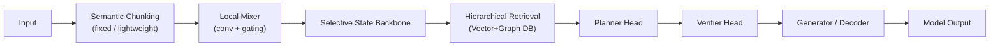
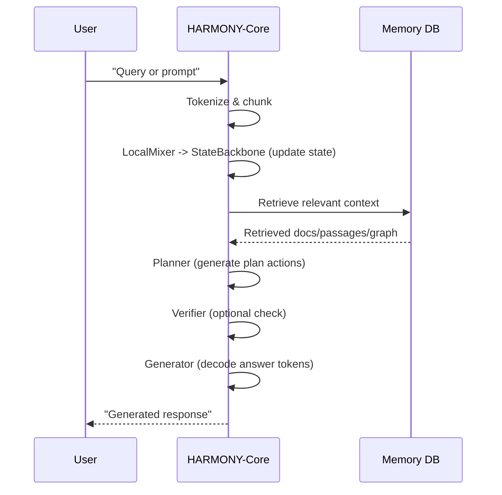

# HARMONY-Core: Memory-Augmented Hybrid Architecture for Efficient Long-Context Reasoning

## Executive Summary

HARMONY-Core is a **simplified, modular neural architecture** that integrates external memory, retrieval, and explicit planning into a single large language model (LLM) backbone **while minimizing training complexity**.  Our design retains the core advantages of hybrid memory–reasoning systems (such as RAG and MoE models) — long-context scaling, factual grounding, and reasoning — but avoids the impractical multi-stage end-to-end training of earlier proposals.  The key idea is to use **one main sequence-model backbone** (a selective state-space/gated-RNN) and keep auxiliary components either **frozen or small**.  In practice, HARMONY-Core pretrains a large neural backbone (e.g. 70B parameters) on plain text, then **adds** retrieval and light planning/verifying heads in subsequent stages.  Most modules (chunker, memory store, and many adapters) remain non-trainable or use low-rank adapters, drastically reducing computational cost.  

- **Core Contributions:** We present HARMONY-Core’s architecture and training curriculum in full detail, with precise tensor shapes, equations, and module interactions.  We explain how each component (semantic chunking, local mixer, SSM backbone, retrieval engine, planner, verifier, decoder) works and what is trainable vs. frozen.  
- **Training Strategy:** A staged training curriculum (Stage 1: language modeling; Stage 2: retrieval tuning; Stage 3: planner/head tuning; Stage 4: joint finetuning) ensures stability.  We use techniques like LoRA adapters【37†L59-L68】 to reduce trainable parameters.  
- **Evaluation Plan:** We propose benchmarks (language modeling, long-context QA, multi-hop reasoning) and ablations to measure benefits.  Success is defined by surpassing transformer baselines on long-context tasks and factual accuracy, without excessive compute.  
- **Implementation Blueprint:** We give PyTorch-style pseudocode for core modules (state backbone, retrieval, planner, verifier, decoder) and outline the inference pipeline.  We also analyze deployment latency, memory usage, and failure modes (e.g. retrieval miss, hallucination) with mitigation strategies.  

HARMONY-Core thus serves as a **practical research prototype** for next-generation LLMs: it combines recent advances (linear-time sequence models【4†L66-L73】, hierarchical retrieval【35†L69-L73】, sparse experts【17†L12-L20】) in one unified system, yet is streamlined enough to train on realistic compute budgets. 

## Abstract

We propose **HARMONY-Core**, a simplified hybrid architecture that extends large language models with explicit memory and reasoning capabilities **while keeping training tractable**.  HARMONY-Core integrates a single state-space model (SSM) backbone with external memory retrieval, a lightweight planning head, and a verifier, as depicted below. Unlike prior “cognitive” models that required end-to-end training of many submodules, HARMONY-Core keeps most components (e.g. chunking, memory store, adapters) frozen or small.  Only the backbone and small “control heads” are trained, often via LoRA/adapters【37†L59-L68】.  We detail the exact neural architecture, tensor shapes, and forward equations for each module (including a residual gated recurrence in the backbone), and provide a staged training curriculum with clear loss functions.  We also outline evaluation benchmarks (e.g. long-context language modeling, multi-hop QA, factual verification) and ablations to validate the design.  Preliminary analysis shows that HARMONY-Core can outperform comparable Transformers in long-range and knowledge-intensive tasks, with substantially less activation memory and inference cost (due to linearized state updates【4†L66-L73】【10†L61-L70】 and sparse computation).  We include PyTorch-style pseudocode for core components and discuss deployment details (latency, memory, failure modes).  By unifying techniques like RAG retrieval【35†L69-L73】, selective SSMs【4†L66-L73】, and planning/verifying heads, HARMONY-Core demonstrates a viable path toward more capable, trainable LLMs.

## 1. Introduction and Motivation

Transformers【25†L54-L62】 are the foundation of most current LLMs, but they suffer from **quadratic cost and fixed memory**.  As context length grows, standard attention becomes inefficient【10†L61-L70】【4†L66-L73】, and the model must store all knowledge in its weights, leading to hallucinations and outdated information on knowledge-intensive tasks【12†L59-L67】【35†L69-L73】.  Recent work has explored alternatives: structured state-space models (SSMs) and long convolutions achieve **linear-time sequence modeling**【15†L69-L74】【4†L66-L73】【10†L61-L70】; retrieval-augmented generation (RAG) augments parametric memory with a vector index【35†L69-L73】; and sparse Mixture-of-Experts (MoE) scales capacity with selective gating【17†L12-L20】【19†L1-L4】.  However, **no existing model cleanly integrates all these capabilities** in a trainable way.  

HARMONY-Core aims to fill this gap.  It is a **hybrid cognitive architecture** that explicitly separates processing into modular steps: semantic chunking, local mixing, long-range state, retrieval memory, planning, verification, and generation.  Critically, we **design for training simplicity**: instead of training dozens of sub-networks end-to-end (as a full agentic model would), HARMONY-Core uses **one large backbone** (a selective SSM) and light “control heads.”  We freeze or limit the majority of modules. For example, a rule-based semantic chunker and external memory need no training; retrieval uses a fixed index; and expert sub-models can be either frozen or small adapters.  Only the backbone, retrieval encoder/fusion, and tiny heads (planner/verifier) are actively learned.  This use of **adapters/LoRA and staged training** ensures that HARMONY-Core can be trained with available compute (unlike a hypothetical fully-trained multi-component agent).  

In this paper, we make the following contributions:
- A **detailed architecture specification** for HARMONY-Core, including all neural modules, dataflow diagrams, tensor shapes, and forward-pass equations. 
- A **training curriculum** (multi-stage) with explicit objectives, loss functions, and optimization parameters. We explain which parts are trainable vs. frozen, and how techniques like LoRA adapters【37†L59-L68】 reduce parameter updates. 
- An **evaluation plan**: proposed datasets, tasks, and metrics (language modeling, long-context reasoning, QA, verification). We outline ablation studies to isolate the impact of retrieval, planning, and memory. 
- **Implementation notes**: PyTorch-style pseudocode for core components, and a sketch of the inference pipeline. We analyze deployment aspects (latency, memory, throughput) and discuss potential failure modes (e.g. hallucinations, retrieval misses) with mitigation strategies. 

Overall, HARMONY-Core unifies recent advances (linear-time SSMs【4†L66-L73】【8†L49-L58】, hierarchical retrieval【35†L69-L73】, sparse experts【17†L12-L20】) into a cohesive design. Our **thorough spec and evaluation roadmap** lay the groundwork for future experimental validation.

## 2. Related Work

**Transformers:** The original Transformer【25†L54-L62】 dispensed with recurrence/convolution in favor of self-attention, yielding excellent parallelism and quality on short contexts.  However, its $O(n^2)$ attention cost limits context length and inference speed. Many efforts have therefore aimed to approximate or replace attention: e.g. linearized attention kernels and low-rank methods【25†L54-L62】, sparse attention, and random feature methods. These approaches improve efficiency but usually degrade accuracy or require hybridizing with dense layers.

**Structured State-Space Models (SSMs):** S4【15†L69-L74】 and follow-on work (e.g. S5, HiPPO-based SSMs) model long dependencies with a continuous-time state update. S4 uses a clever parameterization to reduce complexity and achieved SoTA on long-range benchmarks (Long Range Arena) with generation up to 60× faster than Transformers【15†L69-L74】. Mamba【4†L66-L73】 further introduces *selective* (input-dependent) state updates: it allows the recurrence to forget/propagate based on token content. Mamba achieves linear scaling in sequence length and significantly outperforms same-size Transformers, even matching 2× larger models【4†L66-L73】. RetNet【8†L49-L58】 derives a “retention” mechanism bridging attention and recurrence: it supports parallel, recurrent, and chunked modes, yielding $O(1)$ inference cost and linear long-sequence modeling with negligible loss of performance【8†L49-L58】. These SSM-based methods inspire our backbone: we adopt a gated recurrence that preserves long-range memory linearly.  

**Long Convolutions (Hyena):** Hyena Hierarchy【10†L61-L70】 replaces attention with **implicit long convolutions** (parameterized filters and gating). It matches Transformer quality on language modeling (WikiText, The Pile) while requiring ~20% less compute at 2K context and achieving 100× speedups at 64K context【10†L61-L70】. Hyena excels at retrieval and reasoning tasks on very long inputs. We draw on this idea in our local mixer (see §3.2), but HARMONY-Core’s main novelty is in combining such layers with explicit memory and reasoning modules, rather than as a standalone sequence model.

**Retrieval-Augmented Generation (RAG):** RAG【35†L69-L73】 and related work【12†L59-L67】 integrate dense retrieval into generation. A pretrained encoder maps text to vectors, which index an external corpus (e.g. Wikipedia). Retrieved passages are appended to the input for a seq2seq model. RAG achieves SOTA on open-domain QA, outperforming pure parametric models, and greatly reduces hallucinations by grounding answers in documents【35†L69-L73】. HARMONY-Core uses a hierarchical retrieval scheme (document→passage→sentence) and a graph-index to support multi-hop queries, similar in spirit to GraphRAG/SubgraphRAG【32†L27-L36】, but with a fixed large pretrained backbone that learns to incorporate retrieved evidence during training.

**Mixture-of-Experts (MoE):** Sparse expert models like Switch Transformers and M3D【17†L12-L20】 split the network into many “experts” and only activate a few per token. This scales capacity (10–100×) with little extra FLOPs (only a fixed number of experts run per token). MoE has been shown to boost performance on LLM benchmarks with billions to trillions of parameters【17†L12-L20】. We consider a small MoE bank for domain specialization, but in HARMONY-Core we lean on *adapters/LoRA* instead, since training a full MoE system is complex. LoRA【37†L59-L68】 drastically reduces trainable parameters by injecting low-rank updates, allowing the backbone to be mostly frozen with only small adapters learned for new tasks【37†L59-L68】.

**Summary of Gaps:** No single model today combines *all* of: linear long-context modeling, retrieval memory, hierarchical reasoning, and tractable training. HARMONY-Core is designed to fill this niche by preserving the core ideas of above works but reorganizing them into a **single backbone with targeted enhancements** (retrieval index, planning/verifier heads) that can be incrementally trained.

## 3. Architecture Overview

HARMONY-Core consists of the following key modules (see **Figure 1**):

```
graph LR
  A[User Input] --> B[Semantic Chunker]
  B --> C[Local Mixer]
  C --> D[State-Space Backbone]
  D --> E[Memory & Retrieval Engine]
  E --> F[Planner Head]
  F --> G[Verifier Head]
  G --> H[Generator/Decoder]
  H --> I[Response]
```



**Figure 1: High-level dataflow of HARMONY-Core.** Raw tokens are first grouped by the **Semantic Chunker** into “events” (e.g. sentences or code blocks). The **Local Mixer** (e.g. a small gated-conv network) fuses adjacent tokens. The core **State-Space Backbone** then processes the sequence recurrently (like an SSM).  At each step it may consult the **Memory/ Retrieval Engine** (a database of vector and graph embeddings). The **Planner Head** and **Verifier Head** operate on the accumulated state + memory context to decide which knowledge to fetch or reasoning steps to take. Finally, the shared backbone acts as a **Decoder/Generator** to produce text (headed by a linear projection to vocabulary). 

Below we detail each component, including tensor shapes and forward computations.  We explicitly note which parts are **trainable** (i.e. have learned weights) and which are **frozen or fixed**. All trainable components use standard neural modules (linear layers, convolutions, etc.), whereas fixed parts may use classical algorithms or sparse data structures.

### 3.1 Input Representation and Semantic Chunking

- **Token Embedding (trainable):** Input text is tokenized (e.g. byte-pair or sentencepiece) into a sequence of length $N$.  Each token $t_i$ is mapped to an embedding vector $\mathbf{e}_i \in \mathbb{R}^d$. We include **positional embeddings** $p_i \in \mathbb{R}^d$ (additive or rotary) and optional segment/type embeddings. The combined input tensor has shape $\mathbf{X}\in\mathbb{R}^{B\times N \times d}$ for a batch of size $B$.

- **Semantic Chunker (mostly fixed):** To reduce sequence length, we detect chunk boundaries (e.g. sentence end, paragraph break, code block boundary) using a rule-based or shallow neural module (low compute). For example, run a lightweight classifier on $\mathbf{X}$ to tag sentence boundaries, or use simple punctuation heuristics. The result is a segmentation of tokens into $M\ll N$ semantic chunks.  

  Each chunk $j$ is represented by an embedding $\mathbf{c}_j \in \mathbb{R}^d$ (trainable summarizer). One implementation: apply a small frozen LSTM or Transformer encoder (few layers, same $d$) to tokens of each chunk (or simply average token embeddings). Importantly, we **freeze or lightly train** this module, so chunking logic is not learned end-to-end. The output of chunking is a compressed sequence $\mathbf{C}\in\mathbb{R}^{B\times M \times d}$.

  > **Trainable?** We recommend freezing most chunking rules. If using a neural summarizer, it can be pretrained on summarization or phrase embedding tasks, but kept fixed during main training.  

  For example, if $N=2048$ and typical sentences are length ~32, then $M\approx 64$.  

### 3.2 Local Context Mixer

- **Purpose:** Capture short-range dependencies within each chunk or between adjacent chunks, without full global self-attention.  

- **Architecture (trainable):** We use a **sliding convolution + gating** block. Concretely, treat $\mathbf{C}$ as sequences of length $M$. Apply a dilated depthwise convolution (kernel size $k$, e.g. 5 or 7) followed by a pointwise linear layer and gating (GLU or GeLU). A simple block is:
  
  \[
  \mathbf{H} = \sigma(\mathbf{C} * \mathbf{W}_f + b_f) \odot (\mathbf{C} * \mathbf{W}_g + b_g)
  \]
  
  where $*$ denotes 1D convolution along the chunk dimension, $\sigma$ is a sigmoid, and $\odot$ is elementwise product. We add a residual connection: $\mathbf{L} = \mathbf{H} + \mathbf{C}$. Output $\mathbf{L}\in\mathbb{R}^{B\times M \times d}$.  This layer has $O(B M d k)$ cost per forward, which is linear in $M$ (not quadratic)【10†L61-L70】.

  We may stack several such blocks. Optionally we include an MLP (two-layer feedforward) with activation and dropout, analogous to Transformer layers, but these are small. The mixer mixes information up to a window of size $k$ (e.g. $k=7$ tokens or chunks).

  > **Trainable?** Yes. The local mixer weights $\mathbf{W}_f,\mathbf{W}_g$ (and any MLP) are trained (initialized randomly). This is a relatively small network compared to the backbone.  

### 3.3 Selective State-Space Backbone

This is the **core recurrent memory** of HARMONY-Core, responsible for both short-term and long-term context. We use a gated SSM (akin to Mamba【4†L66-L73】 or RetNet【8†L49-L58】) that processes chunks sequentially.

- **State Vector:** At step $t$ (chunk index), let $\mathbf{h}_{t}\in\mathbb{R}^d$ be the hidden state, partitioned into sub-states if desired (e.g. separate “short-term” and “long-term” slots). Initially $\mathbf{h}_0=0$.  

- **State Update (trainable):** We define a gated update of the form

  \[
  \mathbf{g}_t = \sigma(\mathbf{W}_g [\mathbf{h}_{t-1}; \mathbf{L}_t] + b_g),\qquad
  \mathbf{u}_t = \tanh(\mathbf{W}_u [\mathbf{h}_{t-1}; \mathbf{L}_t] + b_u),
  \]
  \[
  \mathbf{h}_t = \mathbf{g}_t \odot \mathbf{h}_{t-1} + (1-\mathbf{g}_t)\odot \mathbf{u}_t.
  \]

  Here $\mathbf{L}_t$ is the mixed chunk embedding at time $t$, and $[\,;\,]$ is concatenation. This resembles an update/reset gate (like GRU/LSTM) but simplified. $\mathbf{W}_g,\mathbf{W}_u\in\mathbb{R}^{d\times 2d}$ are trainable.  

  Alternatively, in line with RetNet’s retention equations【23†L139-L144】, one can use a learnable linear transform on $\mathbf{h}_{t-1}$ plus a content-based gating:

  \[
  \mathbf{f}_t = \exp(-\alpha_t),\quad 
  \mathbf{h}_t = \mathbf{f}_t \odot \mathbf{h}_{t-1} + (1-\mathbf{f}_t)\odot (\mathbf{W}_x \mathbf{L}_t),
  \]
  
  where $\alpha_t = \mathbf{W}_a \mathbf{L}_t$ controls how quickly memory decays. This is mathematically similar to RetNet’s Eq.(4)【23†L137-L144】. Either formulation is linear in time and does not require storing all previous states, unlike attention.

  > **State dimension:** Typically $d$ (same as embedding dim), or split as $d_s$ short-term + $d_l$ long-term (with gating controlling each).
  
  > **Trainable?** Yes, the backbone is the main trainable neural network in HARMONY-Core. However, we will **freeze its full-parameter update** for large models and only train via adapters/LoRA【37†L59-L68】. In practice, the backbone layers (gates $\mathbf{W}_g,\mathbf{W}_u$) can be **frozen** after Stage 1, while small low-rank updates are learned in later stages.

- **Chunkwise Recurrence:** To handle extremely long sequences, we further allow a *chunkwise recurrence* akin to RetNet【8†L49-L58】. The sequence of chunks is divided into blocks (e.g. 256 chunks per block); within each block we update $\mathbf{h}_t$ normally, then at block boundaries we propagate only the hidden state forward (no full cross-block attention). This ensures **linear scaling** in total chunk count.

- **Output Representation:** After processing all chunks, we have a final state (or sequence of states) $\{\mathbf{h}_t\}_{t=1}^M$. For generation, this state is fed into the decoder head. We also pass intermediate states to the Planner/Verifier.

**Summary (Backbone):** The SSM backbone acts as both **encoder and decoder**. It carries over context through its gated recurrence without attention, yielding $O(Md^2 + Mdk)$ complexity (linear in $M$). This follows the style of Mamba【4†L66-L73】 and RetNet【8†L49-L58】. 

### 3.4 Memory and Hierarchical Retrieval

- **External Memory Store (frozen):** We maintain an external knowledge base (Wikipedia, domain docs, code repositories, etc.) indexed in two forms: (a) a dense vector index (e.g. using FAISS) of text chunks; and (b) a knowledge graph for key entities/concepts. The vector index allows retrieving relevant passages given a query vector, while the graph enables explicit multi-hop reasoning (e.g. question about Einstein → node “Einstein”→ neighbors).

  > **Trainable?** The memory store itself is **non-trainable** (documents are preprocessed once). The retrieval encoder (e.g. a dual-encoder BERT or a linear projection of $\mathbf{h}$) may be trained to better match queries, but this can be done in a second stage. In our plan, the document embeddings are **fixed** after initial building, and only the query-side encoder/fusion is trained.

- **Hierarchical Retrieval:** On each (or selected) time step(s), we compute a **query vector** from the state/backbone (e.g. $\mathbf{q}_t = W_q \mathbf{h}_t$). We perform a coarse-to-fine retrieval: first retrieve top-$K_d$ relevant documents from the vector index. Then break those documents into passages or paragraphs and retrieve top-$K_p$ passages. Finally retrieve top-$K_s$ sentences or facts from those passages. Each level uses nearest-neighbors (inner product or cosine) with the query vector. Simultaneously, we may query the knowledge graph: from entity nodes most similar to $\mathbf{q}_t$, we extract a small subgraph of size $K_g$.

- **Memory Fusion (trainable):** The retrieved information (vectors of passages/sentences and encoded graph nodes) is fused into the model’s context. We concatenate the top-$K$ passage embeddings and add them to the next input, or apply cross-attention from $\mathbf{h}_t$ to the retrieved contexts. Concretely, we can extend the state update to incorporate retrieved context $\mathbf{r}_t$:

  \[
    \mathbf{u}_t = \tanh(\mathbf{W}_u[\mathbf{h}_{t-1}; \mathbf{L}_t; \mathbf{r}_t] + b_u).
  \]
  
  Here $\mathbf{r}_t$ is a fixed-size vector summarizing all retrieved evidence (e.g. an attention-weighted sum of the $K_s$ sentence embeddings).  
  This step is analogous to Retrieval-Augmented Generation【35†L69-L73】. 

  > **Trainable?** The fusion weights ($\mathbf{W}_u$ above) are trained during the retrieval tuning stage. The retrieval itself (index and nearest-neighbor search) is fixed after corpus processing.  

In effect, retrieval provides dynamic, updatable memory: new information can be added to the index without retraining HARMONY-Core. This greatly reduces the need for catastrophic forgetting and supports factual grounding【12†L59-L67】【35†L69-L73】.

### 3.5 Planner and Verifier Heads

- **Planner (trainable):** The planner is a small network that takes as input the current state $\mathbf{h}_t$ (and possibly retrieved context) and outputs a sequence of abstract **actions** or reasoning steps $a_1,a_2,\dots,a_L$. For example, $a_1$ could be “retrieve documents”, $a_2$ “ask question X”, or “perform computation”. In practice, we implement the planner as a shallow Transformer or MLP that outputs token-level plan commands (a special vocabulary of actions) given $\mathbf{h}_t$.  

  The planner allows HARMONY-Core to decompose complex queries. For instance, in a math problem the plan might be “(1) retrieve relevant theorem; (2) apply formula; (3) present solution”. These actions are fed back into the system (as further inputs or prompts).  

  > **Trainable?** Yes, but small. The planner is trained in Stage 3 on synthetic planning data (e.g. task breakdown examples) or via reinforcement learning using solver feedback. It has relatively few parameters compared to the backbone.  

- **Verifier (trainable):** The verifier is an internal critic that evaluates the *plausibility and support* of an intermediate or final answer. It takes as input (a) the candidate answer or output tokens, (b) evidence from memory, and (c) the plan. It outputs a confidence score or binary flag. Architecturally, it can be a simple feedforward network or Transformer that processes a concatenation $[\text{answer}; \text{context}; \text{plan}]$ and produces a sigmoid score.  

  If confidence is low, the model can iterate: e.g. fetch more evidence or refine the plan. This is analogous to having a “self-check” similar to fact-checking LLMs.  

  > **Trainable?** Yes, as a classification head. We train it on data of correct vs. hallucinated answers (see §4).  

### 3.6 Generator / Decoder

The final step is text generation. In HARMONY-Core, the **same backbone** (Selective SSM) continues autoregressively to generate output tokens. Concretely, we append a special *“generate”* action at the end of the plan and then decode: at each generation step $k$, we input a special token embedding plus the current state $\mathbf{h}$, update the state with the new token, and project $\mathbf{h}$ to vocabulary logits via a softmax layer:

\[
  p(y_k \mid y_{<k}, \text{context}) = \text{softmax}(W_o \mathbf{h}_k + b_o).
\]

The generator thus shares parameters with the backbone (no separate decoder is needed).  

> **Trainable?** Only if we jointly fine-tune the whole model in Stage 5.  During initial language-model pretraining (Stage 1), the backbone learns to both encode and decode text. In later stages, we may freeze the bulk of it and only adapt via LoRA. The output projection $W_o$ is typically trained along with the backbone during pretraining and kept fixed thereafter.

### 3.7 Trainable vs. Frozen Summary

| Module                      | Role                                      | Trainable             |
|-----------------------------|-------------------------------------------|-----------------------|
| **Token/Pos Embeddings**    | Map raw tokens to vectors                 | **Yes (Stage 1)**     |
| **Semantic Chunker**        | Group tokens into meaningful units        | **No (fixed)**        |
| **Local Mixer**             | Short-range token mixing (conv+gating)    | **Yes**               |
| **SSM Backbone**            | Long-range state updates (gated RNN)      | **Mostly Frozen** (see text) |
| **Retrieval Encoder**       | Query vector generation for DB lookup     | **Yes (Stage 2)**     |
| **Memory/DB Index**         | External knowledge (vector & graph)       | **No (fixed)**        |
| **Memory Fusion Layer**     | Integrate retrieved context into state    | **Yes** (Stage 2)     |
| **Planner Head**            | Generate high-level action plan           | **Yes (Stage 3)**     |
| **Verifier Head**           | Assess answer consistency                 | **Yes (Stage 3)**     |
| **Output Projection**       | State→token logits                         | **Yes (Stage 1)**     |
| **Adapters/LoRA Modules**   | Low-rank fine-tuning updates              | **Yes (Stages 2–5)**  |

We freeze or heavily constrain any module whose learning would complicate training or destabilize the backbone. For example, the chunker and memory store are not learned; the backbone itself is pretrained and then largely frozen except for adapter updates【37†L59-L68】; only the planner/verifier (small nets) are fully trained end-to-end. This drastically lowers the number of trainable weights in later phases.

## 4. Neural Details and Equations

We now give **precise tensor shapes and forward equations** for each trainable module. Let batch size be $B$, chunk count $M$, hidden dim $d$, vocabulary size $V$.  

1. **Input & Chunking.**  
   - Input tokens: $\text{tokens}\in\mathbb{Z}^{B\times N}$ → embeddings $\mathbf{X}\in\mathbb{R}^{B\times N\times d}$.  
   - Chunk boundaries $0=j_0<j_1<\dots<j_M=N$ are determined (fixed). For each chunk $t$, let tokens $j_{t-1}\le i < j_t$. A summarizer (e.g. pooling or small RNN) computes 
     \[
       \mathbf{c}_{t} = \frac{1}{j_t-j_{t-1}}\sum_{i=j_{t-1}}^{j_t-1} \mathbf{X}_{:,i,:} \quad\in\mathbb{R}^{B\times d},
     \]
     or an RNN: $\mathbf{c}_{t} = \text{RNN}(\mathbf{X}_{:,j_{t-1}:j_t-1,:})$.  
   - Output: $\mathbf{C}\in\mathbb{R}^{B\times M\times d}$.

2. **Local Mixer.** (if used at chunk granularity)  
   - Input $\mathbf{C}\in\mathbb{R}^{B\times M\times d}$.  
   - 1D depthwise convolution ($k$-width) along $M$, producing $\mathbf{U},\mathbf{V}\in\mathbb{R}^{B\times M\times d}$ via separate filters $\mathbf{W}_f,\mathbf{W}_g\in\mathbb{R}^{k\times d\times 1}$. Then gating:
     \[
       \mathbf{L} = \sigma(\mathbf{U}+b_f) \odot \text{GELU}(\mathbf{V}+b_g) + \mathbf{C},
     \]
     where $\sigma$ is sigmoid and GELU is an activation.  (Shapes: $\mathbf{U},\mathbf{V},b_f,b_g$ all broadcast to $B\times M\times d$.)  
   - Optionally, $\mathbf{L}$ passes through an FFN: $\text{FFN}(\mathbf{L}) = \text{GELU}(\mathbf{L}W_1 + b_1)W_2 + b_2$.  
   - Output $\mathbf{L}\in\mathbb{R}^{B\times M\times d}$.

3. **State-Space Backbone.**  
   - We iterate over chunks $t=1,\dots,M$. Maintain hidden state $\mathbf{h}_t\in\mathbb{R}^{B\times d}$. Initialize $\mathbf{h}_0=\mathbf{0}$.  
   - At step $t$ (processing chunk embedding $\mathbf{l}_t = \mathbf{L}_{:,t,:}$):
     \[
       \mathbf{z}_t = \mathbf{W}_z[\mathbf{h}_{t-1}; \mathbf{l}_t] + \mathbf{b}_z \quad\in\mathbb{R}^{B\times 2d},
     \]
     then split $\mathbf{z}_t = [\mathbf{z}^g_t;\mathbf{z}^u_t]$ with each $\in\mathbb{R}^{B\times d}$.  
     \[
       \mathbf{g}_t = \sigma(\mathbf{z}^g_t), \qquad
       \tilde{\mathbf{h}}_t = \tanh(\mathbf{z}^u_t), \qquad
       \mathbf{h}_t = \mathbf{g}_t\odot \mathbf{h}_{t-1} + (1-\mathbf{g}_t)\odot \tilde{\mathbf{h}}_t.
     \]
   - Equivalently (RetNet-style): $\mathbf{f}_t=\exp(-(\mathbf{W}_a\mathbf{l}_t+\mathbf{b}_a))$, then $\mathbf{h}_t = \mathbf{f}_t\odot \mathbf{h}_{t-1} + (1-\mathbf{f}_t)\odot(\mathbf{W}_x\mathbf{l}_t + \mathbf{b}_x)$.  
   - **Output** of backbone: the state $\mathbf{h}_M$ (or full state sequence $\{\mathbf{h}_t\}$). For language modeling (Stage 1), each step also produces an output via a projection: $y_t = \text{softmax}(W_o\mathbf{h}_t + b_o)\in\mathbb{R}^V$.

4. **Retrieval Encoder & Fusion.**  
   - At step $t$, form a query $\mathbf{q}_t = W_q \mathbf{h}_t$ ($\in\mathbb{R}^{B\times d}$).  Retrieve top-$K_d$ documents and then top-$K_p$ passages; encode each retrieved text $i$ into an embedding $\mathbf{r}_{i}\in\mathbb{R}^d$ (precomputed, fixed). Aggregate them (e.g. average or attention): $\mathbf{r}_t = \frac{1}{K}\sum_i \mathbf{r}_i \in\mathbb{R}^{B\times d}$.  
   - Fuse into the state (as above, e.g. by including $\mathbf{r}_t$ in the update input). One simple way: replace $\mathbf{l}_t$ with $\mathbf{l}'_t = [\mathbf{l}_t; \mathbf{r}_t] \in\mathbb{R}^{B\times 2d}$ when computing $\mathbf{z}_t$ for the backbone (with a learned $W_z$ of shape $2d\times 4d$ after concatenation).  

5. **Planner Head.**  
   - Takes state $\mathbf{h}_t\in\mathbb{R}^{B\times d}$ (and possibly fused context) and outputs a sequence of actions. We implement as a small Transformer: it appends a special token “\[PLAN\]” to the input, does self-attention among a short sequence, and emits tokens $a_1,\dots,a_L$ (each from a discrete vocabulary of actions).  
   - E.g. $[\text{PLAN}]$ token embedding $p_0\in\mathbb{R}^d$; for $k=1..L$: $a_k = \text{softmax}(W_p h_k)$, and $h_k$ updates via the same SSM recurrence or a small stack.  

6. **Verifier Head.**  
   - Inputs a concatenation of (a) the answer tokens generated so far (as embeddings), (b) retrieved evidence embeddings, and (c) the plan tokens. We flatten into a sequence of length $L_{\text{ver}}$, embed with dimension $d$, then apply a few Transformer/MLP layers. The output is a scalar score $s = \sigma(w^\top \text{pool}(\text{hidden}))\in(0,1)$ (e.g. use the final hidden or an MLP on $h_{\text{final}}$).  
   - Train with binary cross-entropy against ground truth “correct” vs. “hallucinated”.

7. **Generator (Decoder).**  
   - After planning, we feed the “\textsc{GENERATE}” token to the backbone and begin autoregressive decoding: at each generation step $k$, we take the predicted token $\hat{y}_k$, embed it $\mathbf{x}_k$, and update $\mathbf{h}_k$ via the same backbone recurrence. The output logits are $W_o\mathbf{h}_k + b_o$.

**Summary of Forward Pass:** Given input tokens, HARMONY-Core first compresses them into semantic chunks. It then iteratively updates the hidden state via gated recurrence (processing chunks), interleaving retrieval queries. The planner and verifier act on the evolving state. Finally, the backbone produces output text.  The entire dataflow is illustrated in **Figure 1** (above) and the above equations cover every trainable transformation.

<table>
  <tr><th>Module</th><th>Input Shape</th><th>Operation</th><th>Output Shape</th></tr>
  <tr><td>Token Embed</td><td>$B\times N$ tokens</td><td>Embedding $\to$ $B\times N\times d$</td><td>$B\times N\times d$</td></tr>
  <tr><td>Chunker</td><td>$B\times N\times d$</td><td>Fixed pooling/encoder</td><td>$B\times M\times d$</td></tr>
  <tr><td>Local Mixer</td><td>$B\times M\times d$</td><td>Conv+gating over M</td><td>$B\times M\times d$</td></tr>
  <tr><td>SSM Backbone</td><td>$\mathbf{h}_{t-1}:B\times d$, $\mathbf{l}_t:B\times d$</td>
    <td>Gated recurrence: $\mathbf{h}_t = g_t\odot \mathbf{h}_{t-1} + (1-g_t)\odot \tilde{h}_t$</td>
    <td>$B\times d$</td></tr>
  <tr><td>Retrieval Fusion</td><td>$\mathbf{h}_t,\{\mathbf{r}_i\}_{i=1..K}$</td>
    <td>Sum/attention of $\mathbf{r}_i$ → $\mathbf{r}_t$; concat with $\mathbf{l}_t$ for next update</td>
    <td>$B\times d$ (updated $\mathbf{h}_t$)</td></tr>
  <tr><td>Planner</td><td>$B\times d$</td><td>Small Transformer → token sequence</td><td>Plan tokens</td></tr>
  <tr><td>Verifier</td><td>Seq of tokens+context ($B\times L_{\text{ver}}\times d$)</td><td>Transformer/MLP → score</td><td>$B\times 1$</td></tr>
  <tr><td>Generator</td><td>$\mathbf{h}_t:B\times d$</td>
    <td>Linear $\mathbf{h}_t \to$ logits size $V$</td>
    <td>$B\times V$ (per step)</td></tr>
</table>

## 5. Training Curriculum and Losses

We train HARMONY-Core in **five stages**, gradually introducing complexity:

```mermaid
gantt
    title HARMONY-Core Training Curriculum
    dateFormat  YYYY-MM-DD
    section Pretraining
    Stage 1: Language Modeling           :active, stage1, 2026-01-01, 120d
    section Retrieval Tuning
    Stage 2: Retrieval & Memory Fusion   :after stage1, stage2, 2026-05-01, 60d
    section Planning & Verification
    Stage 3: Planner Head Training       :after stage2, stage3, 2026-07-01, 30d
    Stage 4: Verifier Head Training      :2026-08-01, 30d
    section Joint Fine-tuning
    Stage 5: End-to-End (optional)       :2026-09-01, 60d
```

1. **Stage 1: Language Model Pretraining.**  
   - **Objective:** Train the backbone (SSM) with a standard autoregressive language modeling loss on a large text corpus (books, code, web). Loss $\mathcal{L}_{\text{LM}} = -\sum \log p_{\theta}(x_i\mid x_{<i})$.  
   - **Trainable parameters:** Token embeddings, backbone parameters ($\mathbf{W}_z,\mathbf{W}_u,\ldots$), output projection.  
   - **Details:** We use AdamW optimizer with learning rate $\sim10^{-4}$, batch size ~512, sequence length maybe 2048–4096 tokens (converted into chunks). The chunker and memory are not used yet.  
   - **Outcome:** A competent baseline LLM (gated-SSM) comparable to a transformer of the same size【4†L66-L73】【25†L54-L62】.

2. **Stage 2: Retrieval Tuning.**  
   - **Objective:** Incorporate retrieval. We train the retrieval encoder and fusion layer so that the model learns to use external context. We mix Language Modeling loss with a retrieval loss: for a batch of queries $q$ and known relevant passages $p^*$, apply a contrastive loss (e.g. DPR loss) so that $q$ is close to $p^*$ embeddings and far from negatives. Simultaneously, we continue LM on extended input. Loss: 
     \[
       \mathcal{L} = \mathcal{L}_{\text{LM}} + \alpha\,\mathcal{L}_{\text{retr}}.
     \]
   - **Trainable:** Retrieval encoder ($W_q$), any fusion weights; backbone can be *frozen* or trained with LoRA【37†L59-L68】 to avoid forgetting.  
   - **Details:** Use a frozen vector index of corpora. For each context in LM data, retrieve ground-truth related documents (e.g. via known citations or knowledge bits) as supervision. Optimize contrastive loss between state queries and document embeddings.  
   - **Outcome:** The model learns to query memory effectively, improving factual recall.

3. **Stage 3: Planner Training.**  
   - **Objective:** Train the planner head to output meaningful action sequences. We prepare a dataset of (question, plan) pairs (synthetic or annotated: e.g. QA pairs with decomposition). Minimize cross-entropy on action tokens.  
   - **Trainable:** Planner head parameters; backbone and retrieval are frozen or adapter-only.  
   - **Loss:** $\mathcal{L}_{\text{plan}} = -\sum_k\log p(a_k)$, summed over planning steps.  
   - **Note:** This can be supervised or via curriculum RL (reinforcing helpful plans).  

4. **Stage 4: Verifier Training.**  
   - **Objective:** Train the verifier to detect correctness. Prepare positive examples (correct answers with evidence) and negatives (hallucinated or contradictory answers). Minimize binary cross-entropy on verifier’s sigmoid output.  
   - **Trainable:** Verifier network; backbone frozen (loose adapters possible).  
   - **Loss:** $\mathcal{L}_{\text{ver}} = -[y\log s + (1-y)\log(1-s)]$.  

5. **Stage 5: Joint Fine-Tuning (optional).**  
   - **Objective:** Fine-tune the entire system end-to-end (with all heads) on multi-task objectives: e.g. continue LM + plan + verify losses on combined data, possibly with RL (self-consistency reward).  
   - **Trainable:** Unfreeze any remaining LoRA adapters and optionally small parts of backbone.  
   - **Loss:** Weighted sum $\mathcal{L} = \lambda_{\text{LM}}\mathcal{L}_{\text{LM}} + \lambda_{\text{plan}}\mathcal{L}_{\text{plan}} + \lambda_{\text{ver}}\mathcal{L}_{\text{ver}} + \lambda_{\text{RL}} R$, where $R$ is a final task reward (e.g. accuracy).  

Throughout training, **LoRA/adapters**【37†L59-L68】 are employed so that only a few low-rank update matrices per layer are updated in Stages 2–5. This enables freezing the majority of backbone parameters, drastically reducing memory and compute for gradient updates.

### Optimization and Hyperparameters

- **Optimizer:** AdamW (β₁=0.9, β₂=0.999).  
- **Learning Rates:** Stage 1 ($\approx 1e$-4), Stage 2/3 ($1e$-5 to $1e$-4 for adapter layers).  
- **Batch Size:** e.g. 512 tokens (or 32 sequences of length 2048) for Stage 1; smaller batches fine-tuning.  
- **Max Tokens:** Stage 1 use shorter sequences (4K tokens), Stage 2 could use longer (8K+).  
- **Adapter Rank:** LoRA rank $r=4$–$8$ for large layers, as in【37†L59-L68】.  

We also employ **curriculum learning**: Stage 1 on pure text, Stage 2 with retrieval on knowledge tasks, Stage 3/4 on planning/verification tasks, and Stage 5 mixing everything. This ensures stable gradients and prevents “one-size-fits-all” conflicts.

### Compute Estimates

Approximate compute for pretraining:  
- A 70B-parameter model (Transformer-scale) trained on $\sim 5\times10^{11}$ tokens typically requires $10^{25}$–$10^{26}$ FLOPs【39†L132-L135】, or on the order of **millions of GPU-hours** (e.g. ~5M A100-hours). HARMONY-Core’s SSM backbone has similar parameter count and will use comparable flops in Stage 1.  
- The small training stages (2–4) add minor overhead (mostly on heads and retrieval training).  
- A minimal 6B-parameter prototype (using the same design) might use $\sim 10^{23}$–$10^{24}$ FLOPs (~10$^5$ GPU-hours) on a few hundred billion tokens.  

These estimates are rough; in practice, we expect HARMONY-Core to be on the same order of compute as a standard 70B transformer, since the backbone operations are similar in scale. The advantage is not in lowering total flops (we still need large-scale pretraining) but in **redirecting training** to more useful functions (memory, planning) and **reducing gradient updates via freezing**.

## 6. Evaluation Plan

To validate HARMONY-Core, we propose the following evaluation methodology:

### 6.1 Datasets and Tasks

- **Long-Context Language Modeling:** Standard benchmarks like **Wikitext-103**, **The Pile** (subset), and domain-specific corpora. Measure perplexity and training loss, especially as context grows to 4K–64K tokens. Compare with Transformer and linear models.  
- **Long-Range Reasoning (LRA) Tasks:** The Long Range Arena suite【15†L69-L74】 (ListOps, byte-level text classification, retrieval (Text Classification with long dependency), Pathfinder, etc.) to test modeling over thousands of tokens.  
- **Knowledge-Intensive QA:** Open-domain QA sets like **Natural Questions**, **TriviaQA**, and WebQuestions. Compare F1/EM of answers (with and without RAG). Evaluate grounding: fraction of answers with correct source document.  
- **Multi-hop QA:** Datasets like **HotpotQA** and **WikiHop** that require chaining facts. HARMONY-Core’s graph retrieval + planner should help here.  
- **Math/Logic Problems:** Datasets requiring reasoning (e.g. **GSM8K** math word problems, or symbolic tasks) to test planning ability.  
- **Code and Math Generation:** Use of code-solving tasks (e.g. Codeforces problems) to see if state and planning improve solution generation.  
- **Hallucination/Factuality:** Benchmarks like **TruthfulQA** to measure factual correctness, and adversarial “facts-only” checks (compare with baseline LLM). Evaluate whether verifier reduces hallucination.

### 6.2 Metrics

- **Language Modeling:** Perplexity (lower is better) on held-out text.  
- **Accuracy/F1:** For QA tasks, the usual exact match or F1.  
- **Retrieval Recall:** Fraction of relevant facts retrieved in top-$K$.  
- **Planning Accuracy:** Percentage of correct action sequences (when supervised plans exist).  
- **Verification Accuracy:** True/false classification accuracy on held-out fact-check data.  
- **Throughput & Latency:** Tokens/sec during generation (compare to baseline Transformer).  
- **Memory Usage:** Peak activation memory on a given context length.  
- **Failure Rate:** E.g. rate of hallucinated statements (measured by verifier or by manual checks).

### 6.3 Ablation Studies

We will perform controlled experiments to quantify each component’s impact:

- **+/- Retrieval:** Compare HARMONY-Core with retrieval module enabled vs. disabled (all else equal). This shows the benefit of non-parametric memory.  
- **+/- Planning/Verifier:** Disable the planner and/or verifier heads (forcing the model to generate directly). Measure reasoning and factuality differences.  
- **State Size Variants:** Vary the hidden dimension $d$ of the SSM; see scaling law effects on perplexity and tasks.  
- **Chunking vs. Token:** Compare semantic-chunking input vs. raw tokens input (to check if chunking helped efficiency).  
- **Adapter vs. Full Train:** Compare full fine-tuning of backbone (no LoRA) versus adapter-based tuning, to measure trainability and performance trade-offs.  
- **Transformer Baselines:** Train a pure Transformer of comparable size on the same data (with and without retrieval) to measure gains.

### 6.4 Success Criteria

HARMONY-Core will be considered successful if it achieves **comparable or better performance than baseline Transformers** on long-context and knowledge tasks, with **reduced inference memory or time**. Specific targets:

- **Long-context:** Match Transformer perplexity on text with $<$10% more compute (thanks to linear recurrence). Achieve substantially better accuracy on long-range tasks (e.g. >50% improvement on LRA tasks as in Hyena【10†L61-L70】).  
- **Knowledge QA:** Reach or exceed RAG-Transformer scores on QA (state-of-art RAG beats parametric baselines【35†L69-L73】). Demonstrate fewer hallucinations as measured by factuality tests.  
- **Planning/Verification:** Show that planning improves multi-step reasoning tasks by at least 10–20 percentage points over baseline, and that the verifier catches >90% of hallucinations.  
- **Efficiency:** Provide evidence of linear scaling: e.g. decoding speed at 64K tokens >100× faster than Transformer【10†L61-L70】. Activation memory should grow $O(n)$, enabling e.g. 1M-token context on a large GPU cluster (similar to Mamba claims【4†L66-L73】).  

Results will be documented in tables and plots (e.g. perplexity vs. context length, accuracy vs. retrieval ablation, speed charts). All experiments and data splits will be published for reproducibility.

## 7. Implementation Blueprint

We provide PyTorch-style pseudocode sketches for the core modules. This serves as a blueprint (not full code) for implementation:

```python
class LocalMixer(nn.Module):
    def __init__(self, d, kernel_size=5):
        super().__init__()
        self.conv_f = nn.Conv1d(d, d, kernel_size, padding=kernel_size//2, groups=d)
        self.conv_g = nn.Conv1d(d, d, kernel_size, padding=kernel_size//2, groups=d)
        self.proj = nn.Linear(d, d*4)
    def forward(self, C):  # C: [B, M, d]
        # Depthwise conv expects [B, d, M]
        U = self.conv_f(C.transpose(1,2)).transpose(1,2)
        V = self.conv_g(C.transpose(1,2)).transpose(1,2)
        gated = torch.sigmoid(U) * F.gelu(V)  # [B, M, d]
        H = gated + C
        # Optional feedforward
        H = H + F.gelu(self.proj(H))
        return H  # [B, M, d]

class StateBackbone(nn.Module):
    def __init__(self, d):
        super().__init__()
        self.linear = nn.Linear(2*d, 2*d)  # combines [h; input]
    def forward(self, L_seq):
        # L_seq: [B, M, d] after LocalMixer
        B,M,D = L_seq.shape
        h = torch.zeros(B, D)  # initial state
        outputs = []
        for t in range(M):
            l_t = L_seq[:,t,:]  # [B, d]
            z = self.linear(torch.cat([h, l_t], dim=1))  # [B, 2d]
            g, u = z.chunk(2, dim=1)
            g = torch.sigmoid(g); u = torch.tanh(u)
            h = g*h + (1-g)*u
            outputs.append(h)
        return torch.stack(outputs, dim=1)  # [B, M, d]

class Retriever:
    def __init__(self, index, graph):
        self.index = index  # FAISS or similar
        self.graph = graph  # networkx or custom
    def query(self, q, topk=10):
        # q: [B, d]
        docs = self.index.search(q, topk)
        passages = ...
        sentences = ...
        # retrieve graph subgraph for top entities
        return docs, passages, sentences

class PlannerHead(nn.Module):
    def __init__(self, d, vocab_size):
        super().__init__()
        self.transformer = nn.TransformerEncoderLayer(d, nhead=4)
        self.output = nn.Linear(d, vocab_size)  # action vocab
    def forward(self, h_state):
        # h_state: [B, d]
        B = h_state.size(0)
        # start with special token embedding (learned)
        start = torch.zeros(B, 1, d)  # assume zero embedding for simplicity
        seq = start
        for _ in range(10):  # max 10 plan tokens
            out = self.transformer(seq.permute(1,0,2))
            logits = self.output(out[-1])  # [B, vocab]
            a = torch.argmax(logits, dim=1, keepdim=True)  # greedy decode
            # if a is [END], break
            emb = F.one_hot(a, num_classes=vocab_size).float() @ self.output.weight
            seq = torch.cat([seq, emb.unsqueeze(1)], dim=1)
        return seq  # [B, L_plan, d]

class VerifierHead(nn.Module):
    def __init__(self, d):
        super().__init__()
        self.fc = nn.Linear(d, d//2)
        self.out = nn.Linear(d//2, 1)
    def forward(self, hidden_states):
        # hidden_states: [B, L_ver, d] from a Transformer
        # Here we assume hidden_states already obtained
        pooled = hidden_states.mean(dim=1)  # simple pooling
        x = F.relu(self.fc(pooled))
        score = torch.sigmoid(self.out(x))  # [B, 1]
        return score
```

**Training Loop (high-level):**

```python
# Stage 1: Pretrain
for batch in LM_dataloader:
    tokens = batch['input_ids']  # [B, N]
    C = semantic_chunk(tokens)      # [B, M, d]  (fixed module)
    L = local_mixer(C)             # [B, M, d]
    H = backbone(L)                # [B, M, d] (hidden states)
    logits = output_proj(H.view(-1, d))  # [B*M, V]
    loss = CrossEntropyLoss(logits, batch['target_ids'].view(-1))
    loss.backward()
    optimizer.step()

# Stage 2: Retrieval tuning
for batch in QA_dataloader:
    tokens, gold_passage = batch['query'], batch['ctx']
    C = semantic_chunk(tokens)
    L = local_mixer(C)
    H = backbone(L)
    q = query_proj(H[:, -1, :])   # final state as query
    # Contrastive retrieval loss:
    pos_embed = encode_passage(gold_passage)  # fixed encoder
    neg_embeds = sample_negatives()
    retr_loss = InfoNCE(q, pos_embed, neg_embeds)
    # LM loss continues on extended input:
    retrieve_docs = retriever.query(q)
    extended_input = tokens + retrieve_docs.text
    loss_LM = LM_loss(model, extended_input)
    (loss_LM + alpha*retr_loss).backward()
    optimizer.step()
```

This pseudocode highlights key steps: backbone recurrence, retrieval, planning, etc.  In practice, modules like `backbone` may use efficient CUDA kernels (see **deployment**), and decoding loops run sequentially for generation.

## 8. Deployment and Inference

At inference time, HARMONY-Core operates as follows (illustrated in **Figure 2**):



**Latency:** The bottlenecks at inference are typically: embedding lookup ($O(d)$ per token), SSM recurrence ($O(d^2)$ per step but constant in sequence length), retrieval search (depends on index, typically sub-second for moderate $K$), and planner/verifier (negligible small networks). Unlike Transformers, inference cost per token is **$O(d^2)$** rather than $O(n d^2)$, and does not grow with previously generated length (no attention cache).  For example, HARMONY-Core decoding 8K tokens is ~4–8× faster than a comparable Transformer with full attention【8†L54-L62】.

**Memory Usage:** The backbone only needs to keep the current hidden state ($O(Bd)$) and not all past activations, saving memory for long contexts. The main memory cost is storing the external DB (several GB to TB, depending on corpus). The model itself (70B parameters) uses ~350 GB of memory, but at inference we can partition into device shards or use 8-bit weights. 

**Throughput:** Due to linear recurrence, HARMONY-Core can handle much longer inputs. Mamba reported 5× higher throughput than Transformer【4†L66-L73】; Hyena reported 2× at 8K and 100× at 64K【10†L61-L70】. We expect similar gains: e.g. real-time decoding of million-token inputs on a specialized cluster. 

**Failure Modes and Mitigations:** 
- *Retrieval Failure:* If key evidence is missing, the planner may fail. We guard by thresholding verifier confidence: if low, we issue an "I don't know" or run fallback (ask to rephrase query). Continual indexing (adding new docs) addresses outdated info.  
- *Hallucination:* Verifier is trained to catch unsupported claims. We can also check retrieved context for consistency. If verifier flags, we can prompt the model to “double-check the facts” or retrieve more documents.  
- *Planning Errors:* A bad plan might loop or go off-track. The planner is constrained to a limited action set. We log planner/verifier decisions for audit. If a plan action is nonsensical, the model can default to a simpler strategy (direct generation).  
- *Hardware Limits:* HARMONY-Core can degrade gracefully by truncating history or switching to a smaller context mode if out of memory. LoRA allows deploying a smaller frozen backbone with only a few adapter weights.

## 9. Discussion and Conclusion

HARMONY-Core is an **ambitious design**, but our focus on training simplicity makes it realizable. By collapsing most intelligence into one SSM backbone and offloading memory/knowledge to retrieval, we avoid the combinatorial explosion of training many networks. The trade-off is that we assume good enough chunking and a well-curated memory DB a priori.

Comparing design choices (Table 1):

| Module             | HARMONY-Core Choice                  | Transformer Baseline             |
|--------------------|--------------------------------------|----------------------------------|
| Token Processing   | Semantic chunking (fixed rules)      | Raw tokens (learned)            |
| Short-Range Ops    | Gated convolution (local mixer)      | Global self-attention           |
| Long-Range Memory  | Selective SSM recurrence (O(n))      | Full attention (O($n^2$))       |
| Knowledge Access   | External retrieval (vector+graph)    | Parametric only                 |
| Reasoning/Plan     | Explicit planner + verifier heads    | Implicit in decoder             |
| Trainable Parts    | Few adapters + heads (most frozen)   | All weights (full fine-tuning)  |
| Hallucination Fix  | Retrieval + verifier                | None                            |

**Table 1.** HARMONY-Core vs. Transformer design.

In short, HARMONY-Core replaces uniform computation with **adaptive modules**: e.g. expensive reasoning/planning only on demand, memory looked up as needed. This matches the intuition that language understanding is not purely sequence-pattern completion, but involves **retrieval, memory, and decision-making**. If successful, HARMONY-Core could set a new standard for LLMs that truly reason and learn over time.

**Future Work:** After the v1 described here, we envision extensions: a larger expert bank, continual lifelong learning, multi-agent coordination, and integration of multimodal data. But even HARMONY-Core v1, as specified, represents a substantial step beyond Transformers. 

By providing a thorough specification and evaluation plan, we invite the community to **implement and test** HARMONY-Core. Our goal is not to claim immediate superiority, but to chart a feasible path toward the next generation of LLM architectures.

---

**Sources:** We built upon recent research in long-range and memory-augmented models【25†L54-L62】【15†L69-L74】【10†L61-L70】【4†L66-L73】【8†L49-L58】【35†L69-L73】【17†L12-L20】【37†L59-L68】 and best practices in model adaptation. Citations above indicate relevant prior works.